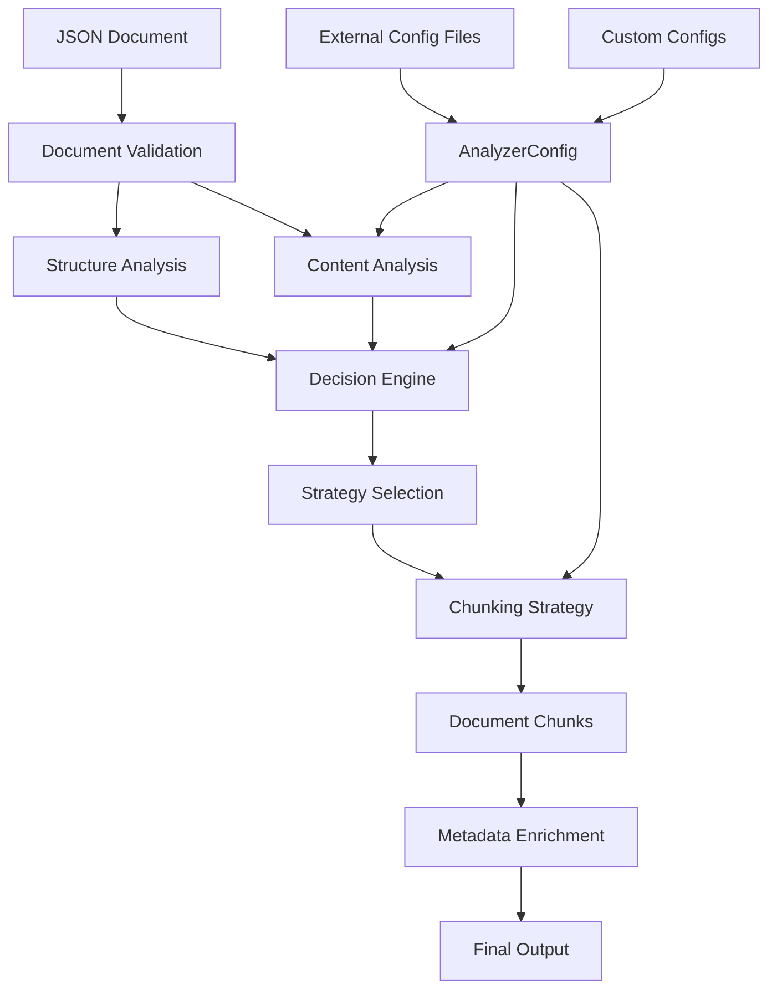
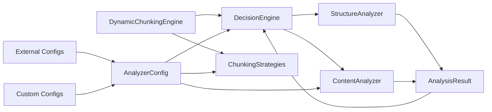
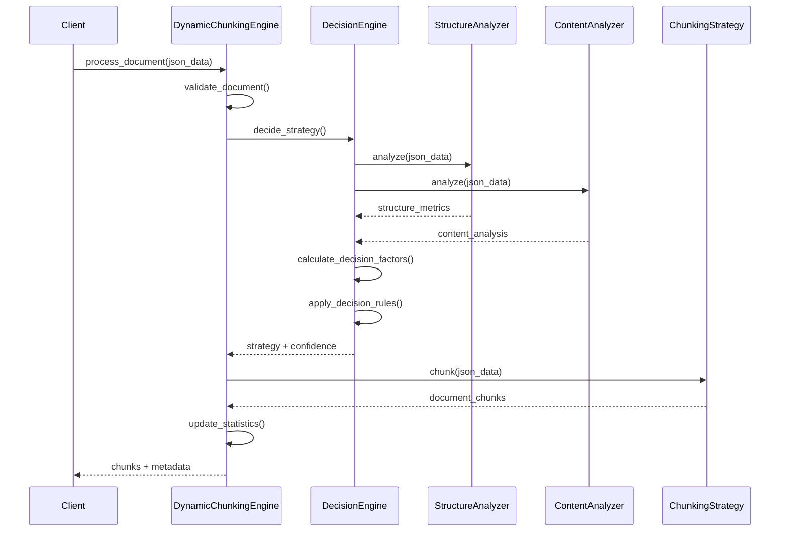
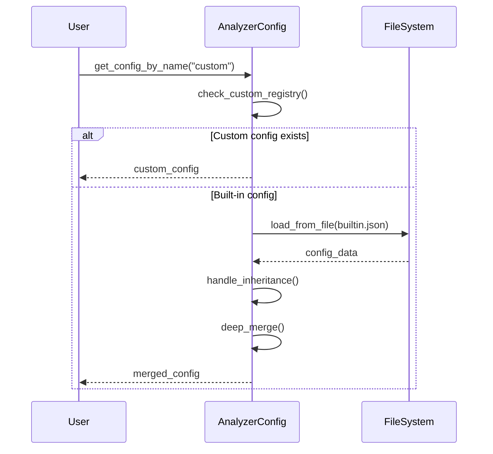
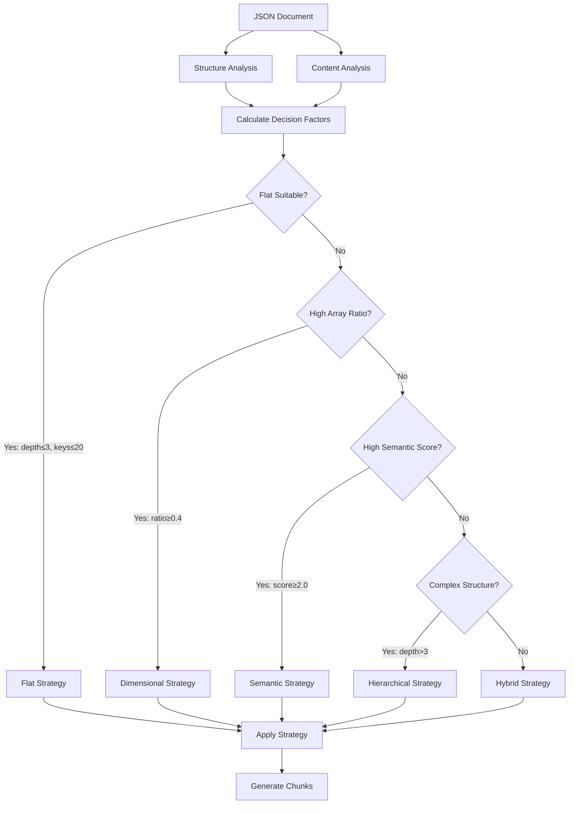
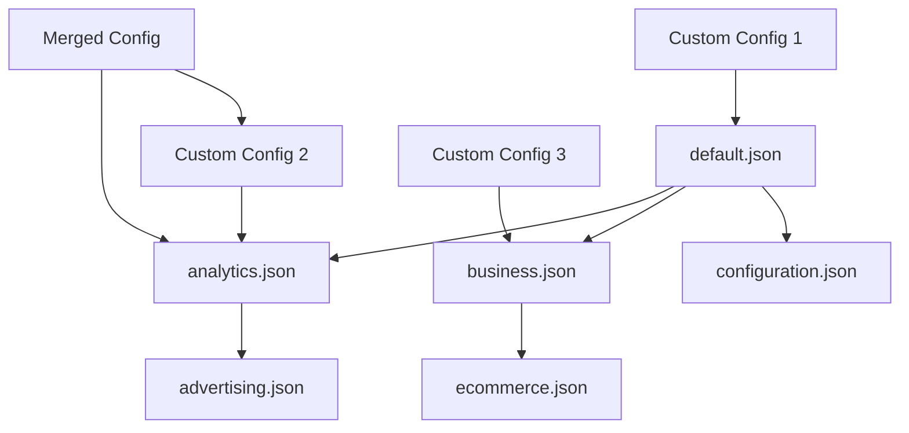

# Dynamic JSON Embeddings - Architecture & Source Code Documentation

## Table of Contents
1. [Project Overview](#project-overview)
2. [Architecture Overview](#architecture-overview)
3. [Project Structure](#project-structure)
4. [Core Components](#core-components)
5. [Data Flow](#data-flow)
6. [Configuration System](#configuration-system)
7. [Source Code Analysis](#source-code-analysis)
8. [Design Patterns](#design-patterns)
9. [Extension Points](#extension-points)

---

## Project Overview

The Dynamic JSON Embeddings system is a production-ready Python library designed for intelligent chunking of hierarchical JSON documents. It automatically selects optimal chunking strategies based on document structure, content patterns, and domain-specific characteristics.

### Key Features
- **Automatic Strategy Selection**: Analyzes JSON documents to choose optimal chunking approach
- **Multiple Chunking Strategies**: Flat, hierarchical, semantic, dimensional, and hybrid approaches
- **Fully Configurable**: External configuration files with inheritance and custom patterns
- **Domain-Agnostic**: Works with any JSON structure through configuration
- **Production-Ready**: Comprehensive error handling, validation, and monitoring
- **Extensible**: Plugin architecture for custom strategies and analyzers

---

## Architecture Overview

### High-Level Architecture



### Component Interaction



---

## Project Structure

```
dynamic-embeddings/
├── pyproject.toml                 # Project configuration & dependencies
├── README.md                      # Project documentation
├── docs/                          # Documentation
│   ├── architecture_and_source_code.md
│   └── custom_configurations.md
├── config/                        # External configuration files
│   ├── default.json              # Base configuration
│   ├── analytics.json            # Analytics patterns (extends default)
│   ├── advertising.json          # Advertising patterns (extends analytics)
│   ├── business.json             # Business patterns (extends default)
│   ├── ecommerce.json            # E-commerce patterns (extends business)
│   ├── configuration.json        # System config patterns (extends default)
│   └── custom_sample.json        # Example custom configuration
├── src/dynamic_embeddings/        # Main source code package
│   ├── __init__.py               # Package entry point
│   ├── core/                     # Core orchestration
│   │   ├── __init__.py
│   │   └── dynamic_engine.py     # Main engine implementation
│   ├── engine/                   # Decision making
│   │   ├── __init__.py
│   │   └── decision_engine.py    # Strategy selection logic
│   ├── strategies/               # Chunking strategies
│   │   ├── __init__.py
│   │   ├── base_strategy.py      # Abstract base and data structures
│   │   ├── flat_strategy.py      # Simple key-value chunking
│   │   ├── hierarchical_strategy.py  # Structure-preserving chunking
│   │   ├── semantic_strategy.py  # Content-aware chunking
│   │   ├── dimensional_strategy.py   # Array/tabular data chunking
│   │   └── hybrid_strategy.py    # Multi-strategy approach
│   ├── analyzers/                # Document analysis
│   │   ├── __init__.py
│   │   ├── base.py              # Base classes and result structures
│   │   ├── structure.py         # JSON structure analysis
│   │   └── content.py           # Content and domain analysis
│   └── config/                   # Configuration management
│       ├── __init__.py
│       ├── analyzer_config.py   # Main configuration class
│       ├── database.py          # Database configuration
│       ├── engine.py            # Engine settings
│       └── settings.py          # Global settings
└── examples/                     # Usage examples and demos
    ├── complete_system_demo.py   # Comprehensive demonstration
    ├── custom_config_examples.py # Custom configuration usage
    ├── decision_engine_usage.py  # Decision engine examples
    └── configuration_usage.py    # Built-in config examples
```

---

## Core Components

### 1. DynamicChunkingEngine (`core/dynamic_engine.py`)

**Purpose**: Main orchestration engine that coordinates all components

**Key Responsibilities**:
- Document processing workflow coordination
- Strategy initialization and management
- Statistics tracking and reporting
- Configuration management
- Batch processing capabilities
- File I/O operations
- Document validation

**Key Methods**:
```python
def process_document(json_data, document_id, force_strategy=None)
def process_multiple_documents(documents, parallel_processing=False)
def process_from_file(file_path)
def process_from_directory(directory_path)
def validate_document(json_data)
def get_strategy_recommendations(json_data)
def switch_config(config_name)
```

**Architecture Pattern**: Facade Pattern - Provides simplified interface to complex subsystem

### 2. DecisionEngine (`engine/decision_engine.py`)

**Purpose**: Automatic strategy selection based on document analysis

**Key Responsibilities**:
- Structure and content analysis coordination
- Multi-factor decision making
- Confidence scoring
- Reasoning generation
- Alternative strategy suggestions

**Decision Factors**:
```python
decision_factors = {
    'size_score': float,           # Document size assessment
    'depth_score': float,          # Nesting depth evaluation
    'complexity_score': float,     # Overall complexity
    'hierarchy_score': float,      # Hierarchical structure strength
    'dimensional_score': float,    # Array/dimensional data presence
    'semantic_score': float,       # Content richness
    'domain_confidence': float,    # Domain specificity
    'flat_suitability': float     # Flat strategy appropriateness
}
```

**Strategy Selection Rules**:
- **Flat**: Simple documents with shallow nesting (depth ≤ 3, keys ≤ 20)
- **Hierarchical**: Complex nested structures (depth > 3, high complexity)
- **Semantic**: Content-rich documents (high semantic score, domain confidence)
- **Dimensional**: Array-heavy data (array ratio > 0.4)
- **Hybrid**: Complex documents requiring multiple approaches

### 3. Chunking Strategies (`strategies/`)

#### BaseChunkingStrategy (`base_strategy.py`)
**Purpose**: Abstract base class defining strategy interface and common utilities

**Data Structures**:
```python
@dataclass
class ChunkMetadata:
    chunk_id: str
    source_path: str
    chunk_type: str
    depth_level: int
    parent_chunk_id: Optional[str]
    size_bytes: int
    key_count: int
    contains_arrays: bool
    domain_tags: List[str]

@dataclass
class DocumentChunk:
    content: Dict[str, Any]
    metadata: ChunkMetadata
    text_representation: str
```

**Common Utilities**:
- Chunk ID generation
- Size calculation
- Key counting
- Array detection
- Validation logic

#### FlatChunkingStrategy (`flat_strategy.py`)
**Purpose**: Simple key-value chunking for flat documents

**Algorithm**:
1. **Flatten JSON**: Convert nested structure to dot-notation paths
2. **Group Keys**: Organize keys into chunks based on `max_keys_per_chunk`
3. **Reconstruct Structure** (optional): Rebuild nested structure for readability
4. **Domain Tagging**: Extract domain tags based on key patterns

**Best For**: Configuration files, simple data structures, API responses

**Example**:
```json
Input: {"user": {"name": "John", "age": 30}, "settings": {"theme": "dark"}}
Output Chunks:
- Chunk 1: {"user.name": "John", "user.age": 30}
- Chunk 2: {"settings.theme": "dark"}
```

#### HierarchicalChunkingStrategy (`hierarchical_strategy.py`)
**Purpose**: Preserves hierarchical structure and relationships

**Algorithm**:
1. **Recursive Analysis**: Traverse structure depth-first
2. **Chunk Decision**: Create chunks based on size, depth, and complexity thresholds
3. **Relationship Preservation**: Maintain parent-child references
4. **Complex Array Handling**: Process arrays based on content complexity

**Best For**: Deeply nested data, configuration trees, organizational structures

**Key Features**:
- Parent-child relationship tracking
- Mixed content type detection
- Configurable depth limits
- Hierarchical context preservation

#### SemanticChunkingStrategy (`semantic_strategy.py`)
**Purpose**: Content-aware chunking based on semantic meaning

**Algorithm**:
1. **Content Analysis**: Calculate semantic richness scores
2. **Region Identification**: Find semantically coherent regions
3. **Content Classification**: Categorize content types (reasoning, performance, descriptive)
4. **Semantic Grouping**: Group related content based on keywords and patterns
5. **Similarity Merging**: Combine similar small regions

**Semantic Scoring Factors**:
- Performance keyword matches (weight: 1.0)
- Reasoning keyword matches (weight: 1.5)
- Domain pattern matches (weight: 0.5)
- Content richness indicators (weight: 2.0)
- Contextual metrics presence (weight: 1.0)

**Best For**: Analytics reports, business intelligence, research data, content-rich documents

#### DimensionalChunkingStrategy (`dimensional_strategy.py`)
**Purpose**: Optimized for array-heavy and tabular data

**Algorithm**:
1. **Array Analysis**: Identify and classify all arrays
2. **Large Array Chunking**: Split arrays exceeding threshold into manageable pieces
3. **Tabular Detection**: Identify homogeneous object arrays as tables
4. **Schema Extraction**: Extract column schemas for tabular data
5. **Metadata Preservation**: Maintain array structure information

**Array Classification**:
- **Simple Arrays**: Primitive values, kept small
- **Complex Arrays**: Objects/nested arrays, individually chunked
- **Tabular Arrays**: Homogeneous objects, chunked with schema preservation
- **Matrix Arrays**: Nested arrays with consistent dimensions

**Best For**: Time series data, OLAP cubes, scientific datasets, logs

#### HybridChunkingStrategy (`hybrid_strategy.py`)
**Purpose**: Combines multiple strategies automatically

**Algorithm**:
1. **Document Analysis**: Analyze overall structure and content distribution
2. **Section Identification**: Identify distinct sections requiring different strategies
3. **Strategy Assignment**: Select optimal strategy for each section
4. **Boundary Optimization**: Merge small chunks, split large ones
5. **Metadata Harmonization**: Ensure consistent metadata across strategies

**Section Analysis Criteria**:
- **Size**: Large documents benefit from hybrid approach
- **Complexity**: Mixed content types require different strategies
- **Array Ratio**: High array content triggers dimensional strategy
- **Semantic Density**: Rich content triggers semantic strategy
- **Depth Variation**: Variable depth suggests hierarchical needs

### 4. Analyzers (`analyzers/`)

#### StructureAnalyzer (`structure.py`)
**Purpose**: Analyzes JSON structural characteristics

**Metrics Calculated**:
```python
structure_metrics = {
    'max_depth': int,              # Maximum nesting depth
    'total_keys': int,             # Total number of keys
    'array_count': int,            # Number of arrays
    'object_count': int,           # Number of objects
    'leaf_node_count': int,        # Terminal values
    'branching_factor': float,     # Average children per node
    'file_size_mb': float,         # Document size
    'complexity_score': float      # Overall complexity
}
```

**Pattern Detection**:
- Hierarchical structure patterns
- Drill-down capabilities
- Array dominance
- Repeating structural patterns

#### ContentAnalyzer (`content.py`)
**Purpose**: Domain and content analysis using configurable patterns

**Analysis Categories**:
1. **Domain Detection**: Uses configurable domain patterns
2. **Entity Recognition**: Identifies business entities
3. **Metric Identification**: Finds performance indicators
4. **Content Classification**: Categorizes content types
5. **Semantic Analysis**: Evaluates content richness

**Configuration-Driven**: All patterns loaded from external configuration files, no hardcoded values

### 5. Configuration System (`config/`)

#### AnalyzerConfig (`analyzer_config.py`)
**Purpose**: Comprehensive configuration management with custom config support

**Built-in Configurations**:
- **default.json**: Base patterns for general JSON
- **analytics.json**: Performance metrics and analytics
- **advertising.json**: Ad-tech analytics and advertising
- **business.json**: Business entities and processes
- **ecommerce.json**: E-commerce and retail
- **configuration.json**: System configuration patterns

**Custom Configuration Features**:
```python
# Registration and management
AnalyzerConfig.register_custom_config(name, path)
AnalyzerConfig.import_config_directory(directory, prefix)
AnalyzerConfig.validate_custom_config(path)

# Templates and merging
AnalyzerConfig.create_custom_config_template(output_path, base_config)
AnalyzerConfig.merge_configs(*config_names, output_name)

# Access and utilities
AnalyzerConfig.get_config_by_name(name)  # Works for built-in and custom
AnalyzerConfig.list_available_configs()
AnalyzerConfig.get_custom_config_info()
```

**Configuration Inheritance**:
- Uses `extends` field for inheritance
- Deep merging of configuration objects
- Override and extension capabilities
- Validation of inheritance chains

---

## Data Flow

### 1. Document Processing Flow



### 2. Configuration Loading Flow



### 3. Strategy Selection Flow



---

## Configuration System

### Configuration Hierarchy



### Configuration Structure

```json
{
  "description": "Configuration description",
  "version": "1.0",
  "extends": "parent_config.json",

  "domain_patterns": {
    "domain_name": ["keyword1", "keyword2", "keyword3"]
  },

  "metric_patterns": {
    "metric_type": "regex_pattern|alternative_pattern"
  },

  "entity_indicators": {
    "entity_type": ["indicator1", "indicator2"]
  },

  "performance_keywords": ["performance", "optimization"],
  "reasoning_keywords": ["analysis", "conclusion"],

  "decision_thresholds": {
    "max_flat_depth": 3,
    "semantic_content_ratio": 0.3,
    "dimensional_array_ratio": 0.4
  },

  "strategy_weights": {
    "structure_weight": 0.4,
    "content_weight": 0.3,
    "size_weight": 0.2,
    "performance_weight": 0.1
  }
}
```

---

## Source Code Analysis

### Code Organization Principles

1. **Single Responsibility**: Each class has one primary purpose
2. **Dependency Injection**: Configuration and dependencies injected, not hardcoded
3. **Strategy Pattern**: Interchangeable chunking algorithms
4. **Factory Pattern**: Strategy creation and configuration loading
5. **Observer Pattern**: Statistics tracking and event logging
6. **Template Method**: Common algorithm structure in base classes

### Key Design Patterns

#### 1. Strategy Pattern
```python
class BaseChunkingStrategy(ABC):
    @abstractmethod
    def chunk(self, json_data: Dict[str, Any]) -> List[DocumentChunk]:
        pass

class FlatChunkingStrategy(BaseChunkingStrategy):
    def chunk(self, json_data: Dict[str, Any]) -> List[DocumentChunk]:
        # Flat chunking implementation
        pass

# Strategy selection and usage
strategy = self.strategies[selected_strategy]
chunks = strategy.chunk(json_data)
```

#### 2. Factory Pattern
```python
class AnalyzerConfig:
    @classmethod
    def get_config_by_name(cls, config_name: str) -> Dict[str, Any]:
        # Factory method for configuration creation
        if config_name in built_in_methods:
            return built_in_methods[config_name]()
        elif config_name in cls._custom_configs:
            return cls.get_custom_config(config_name)
```

#### 3. Facade Pattern
```python
class DynamicChunkingEngine:
    def process_document(self, json_data):
        # Simplified interface hiding complex subsystem interactions
        strategy, details = self.decision_engine.decide_strategy(json_data)
        chunks = self._apply_strategy(strategy, json_data, document_id)
        return chunks, metadata
```

#### 4. Template Method Pattern
```python
class BaseChunkingStrategy:
    def chunk(self, json_data, source_id):
        # Template method defining algorithm structure
        self._validate_input(json_data)
        chunks = self._perform_chunking(json_data, source_id)
        self._enrich_metadata(chunks)
        return chunks

    @abstractmethod
    def _perform_chunking(self, json_data, source_id):
        # Subclasses implement specific chunking logic
        pass
```

### Error Handling Strategy

```python
# Comprehensive error handling with fallback strategies
def process_document(self, json_data, document_id, force_strategy=None):
    try:
        # Primary processing logic
        strategy, details = self.decision_engine.decide_strategy(json_data)
        chunks = self._apply_strategy(strategy, json_data, document_id)
        return chunks, metadata

    except Exception as e:
        # Error logging and statistics
        self.processing_stats['processing_errors'] += 1
        self.logger.error(f"Error processing document {document_id}: {str(e)}")

        # Return error metadata instead of failing
        return [], error_metadata
```

### Performance Considerations

1. **Lazy Loading**: Configurations loaded only when needed
2. **Caching**: Analysis results cached where appropriate
3. **Streaming**: Large document support through chunked processing
4. **Memory Management**: Efficient data structures and cleanup
5. **Parallel Processing**: Support for batch processing

---

## Extension Points

### 1. Adding New Chunking Strategies

```python
from .base_strategy import BaseChunkingStrategy, DocumentChunk, ChunkMetadata

class CustomChunkingStrategy(BaseChunkingStrategy):
    def get_strategy_name(self) -> str:
        return "custom"

    def chunk(self, json_data: Dict[str, Any], source_id: str) -> List[DocumentChunk]:
        # Implement custom chunking logic
        chunks = []
        # ... custom implementation
        return chunks

# Register in DynamicChunkingEngine
engine.strategies[ChunkingStrategy.CUSTOM] = CustomChunkingStrategy(config)
```

### 2. Custom Analyzers

```python
from .base import BaseAnalyzer, AnalysisResult

class CustomAnalyzer(BaseAnalyzer):
    def analyze(self, json_data: Dict[str, Any]) -> AnalysisResult:
        # Implement custom analysis logic
        result = AnalysisResult()
        # ... custom analysis
        return result

# Integration in DecisionEngine
self.custom_analyzer = CustomAnalyzer()
custom_analysis = self.custom_analyzer.analyze(json_data)
```

### 3. Custom Decision Rules

```python
def custom_decision_rules(self, decision_factors):
    # Implement custom decision logic
    if decision_factors['custom_metric'] > threshold:
        return ChunkingStrategy.CUSTOM, 0.9
    # ... custom rules
    return ChunkingStrategy.HIERARCHICAL, 0.7

# Override in DecisionEngine
decision_engine._apply_decision_rules = custom_decision_rules
```

### 4. Custom Configuration Domains

```json
{
  "description": "Custom domain configuration",
  "extends": "default.json",

  "domain_patterns": {
    "my_domain": ["custom", "domain", "keywords"],
    "special_patterns": ["pattern1", "pattern2"]
  },

  "custom_analyzers": {
    "analyzer_class": "path.to.CustomAnalyzer",
    "analyzer_config": {"param1": "value1"}
  }
}
```

---

## Testing Strategy

### Unit Tests
- Individual component testing
- Strategy algorithm verification
- Configuration validation
- Error handling coverage

### Integration Tests
- End-to-end document processing
- Cross-component interaction
- Configuration inheritance
- Performance benchmarking

### Configuration Tests
- Built-in configuration validation
- Custom configuration scenarios
- Inheritance chain testing
- Merge operation verification

---

## Performance Characteristics

### Complexity Analysis
- **Structure Analysis**: O(n) where n = number of JSON nodes
- **Content Analysis**: O(m) where m = content size
- **Decision Making**: O(1) constant time
- **Flat Chunking**: O(n) linear in structure size
- **Hierarchical Chunking**: O(n log n) due to recursive processing
- **Semantic Chunking**: O(n²) worst case for similarity calculations
- **Dimensional Chunking**: O(a × s) where a = array count, s = array size

### Memory Usage
- **Minimal Memory Overhead**: Streaming processing for large documents
- **Configuration Caching**: Loaded configs cached in memory
- **Chunk Size Limits**: Configurable limits prevent memory issues
- **Garbage Collection**: Proper cleanup of large intermediate structures

### Scalability Factors
- **Document Size**: Handles KB to GB range documents
- **Concurrent Processing**: Thread-safe design for parallel processing
- **Configuration Scale**: Supports hundreds of custom configurations
- **Batch Processing**: Efficient multi-document processing

---

This architecture provides a robust, extensible, and production-ready foundation for intelligent JSON document chunking with automatic strategy selection and full customization capabilities.