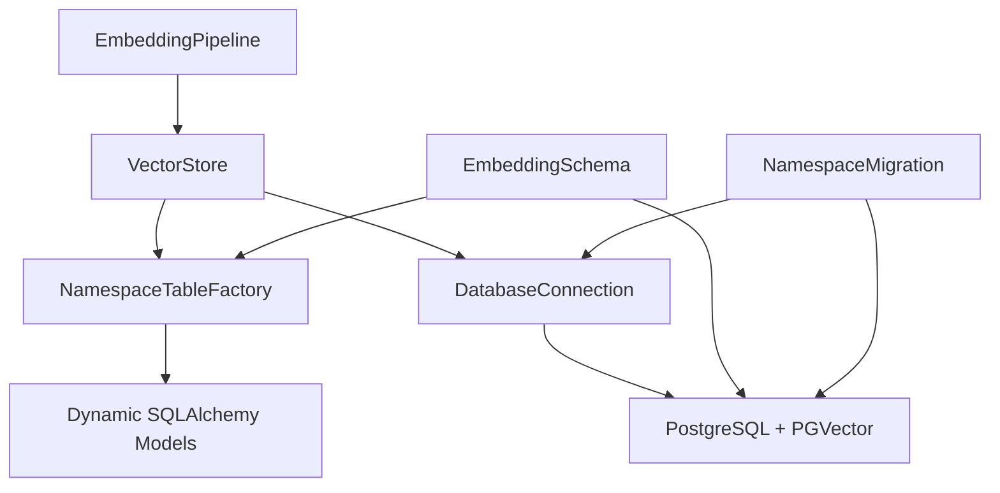

# Vector Storage and Namespace Architecture

## Table of Contents
1. [Overview](#overview)
2. [Namespace Concepts](#namespace-concepts)
3. [Architecture](#architecture)
4. [Database Schema](#database-schema)
5. [Namespace Operations](#namespace-operations)
6. [Migration Guide](#migration-guide)
7. [Collection Management](#collection-management)
8. [API Reference](#api-reference)
9. [Best Practices](#best-practices)
10. [Performance Considerations](#performance-considerations)

---

## Overview

The Dynamic JSON Embeddings system provides a multi-tenant vector storage architecture using PostgreSQL with PGVector extension. The namespace system enables complete data isolation through separate physical tables while maintaining a unified API.

### Key Features
- **Physical Isolation**: Each namespace has its own table (`embeddings_{namespace}`)
- **Automatic Creation**: Namespaces created on first use or explicitly
- **Flexible Migration**: Copy or move data between namespaces
- **Complete API Support**: All operations namespace-aware
- **Collection Support**: Logical partitioning within namespaces via `collection_name`

### Use Cases
- **Environment Separation**: Dev, staging, and production isolation
- **Multi-Tenant Applications**: Per-customer or per-organization data separation
- **Data Versioning**: Maintain multiple versions for A/B testing
- **Compliance**: Geographic or regulatory data isolation
- **Team Workspaces**: Separate workspaces for different teams

---

## Namespace Concepts

### What is a Namespace?

A **namespace** is a logical and physical partition in the vector database. Each namespace:
- Has a dedicated table: `embeddings_{namespace}`
- Contains independent collections
- Maintains separate indexes
- Provides complete data isolation

### Namespace vs Collection

```
Database (vectordb)
│
├── embeddings_default (namespace: default)
│   ├── collection: "devices" (logical partition)
│   ├── collection: "users" (logical partition)
│   └── collection: "products" (logical partition)
│
├── embeddings_production (namespace: production)
│   ├── collection: "campaigns"
│   └── collection: "analytics"
│
└── embeddings_development (namespace: development)
    └── collection: "test_data"
```

**Key Differences**:
- **Namespace**: Physical table, complete isolation, separate indexes
- **Collection**: Logical partition within namespace, shares same table/indexes

### Table Naming Convention

| Namespace | Table Name |
|-----------|------------|
| default | `embeddings_default` |
| production | `embeddings_production` |
| dev | `embeddings_dev` |
| customer_123 | `embeddings_customer_123` |

**Validation Rules**:
- Only lowercase alphanumeric and underscores
- Maximum 50 characters
- Cannot be reserved names (backup, temp, tmp, system, admin)

---

## Architecture

### Component Hierarchy



### Core Components

#### 1. NamespaceTableFactory (`database/schema.py`)

**Purpose**: Dynamic creation and caching of namespace-specific SQLAlchemy models

**Key Features**:
- Dynamic model generation using `type()` and SQLAlchemy Table
- Thread-safe model caching with `threading.Lock`
- Namespace validation and naming
- Table existence checking

**Key Methods**:
```python
class NamespaceTableFactory:
    def get_table_name(namespace: str) -> str
    def get_or_create_model(namespace: str) -> Type[Base]
    def table_exists(namespace: str) -> bool
    def validate_namespace_name(namespace: str) -> bool
```

**Implementation Pattern**:
```python
# Get or create namespace model (cached)
RecordModel = factory.get_or_create_model("production")

# Use in queries
with session() as sess:
    results = sess.query(RecordModel).filter(
        RecordModel.collection_name == "campaigns"
    ).all()
```

#### 2. VectorStore (`services/vector_store.py`)

**Purpose**: Namespace-aware vector operations and similarity search

**Constructor**:
```python
def __init__(self, db_connection: DatabaseConnection, namespace: str = "default"):
    self.namespace = namespace.lower()
    self.table_factory = NamespaceTableFactory(db_connection.engine)
```

**Namespace Parameter Pattern**:
All methods accept optional `namespace` parameter that overrides instance namespace:
```python
def similarity_search(
    self,
    query_vector,
    limit=10,
    collection_name=None,
    namespace: Optional[str] = None,  # Override instance namespace
    similarity_threshold=0.7
):
    target_namespace = (namespace or self.namespace).lower()
    RecordModel = self.table_factory.get_or_create_model(target_namespace)
    # ... use RecordModel in queries
```

#### 3. EmbeddingPipeline (`pipelines/embedding_pipeline.py`)

**Purpose**: High-level API entry point with namespace support

**Constructor**:
```python
def __init__(
    self,
    database_connection,
    openai_api_key=None,
    embedding_model="text-embedding-3-large",
    namespace: str = "default"
):
    self.namespace = namespace.lower()
    self.vector_store = VectorStore(database_connection, namespace=self.namespace)
```

**Namespace Management Methods**:
```python
def create_namespace(namespace: str) -> bool
def list_namespaces() -> List[Dict[str, Any]]
def get_namespace_stats(namespace: str) -> Dict[str, Any]
def drop_namespace(namespace: str, confirm: bool = False) -> bool
```

#### 4. NamespaceMigration (`database/migration.py`)

**Purpose**: Safe data migration between namespaces

**Key Features**:
- Transaction-based migrations with rollback
- Data integrity verification (row count matching)
- Flexible source/target (any namespace or legacy table)
- Copy or move modes
- Backup creation on move

**Key Methods**:
```python
class NamespaceMigration:
    def migrate_namespace(source: str, target: str, mode: str = 'copy') -> Dict
    def migrate_legacy_table(target_namespace: str = 'default') -> Dict
    def copy_namespace(source: str, target: str) -> Dict
    def move_namespace(source: str, target: str) -> Dict
```

---

## Database Schema

### Namespace Table Structure

Each namespace table (`embeddings_{namespace}`) has identical schema:

```sql
CREATE TABLE embeddings_{namespace} (
    id SERIAL PRIMARY KEY,
    chunk_id VARCHAR(512) UNIQUE NOT NULL,
    document_id VARCHAR(512) NOT NULL,
    collection_name VARCHAR(255) NOT NULL,

    -- Content
    text TEXT NOT NULL,
    embedding VECTOR(1536) NOT NULL,

    -- Chunk metadata
    strategy VARCHAR(50) NOT NULL,
    content_type VARCHAR(100) NOT NULL,
    path VARCHAR(4096),
    parent_chunk_id VARCHAR(512),

    -- Hierarchical info
    depth_level INTEGER DEFAULT 0,
    hierarchy_level INTEGER DEFAULT 0,

    -- Quality metrics
    semantic_density FLOAT DEFAULT 0.0,
    confidence FLOAT DEFAULT 1.0,

    -- Size info
    chunk_size INTEGER,
    token_count INTEGER,
    key_count INTEGER,

    -- Flags
    contains_arrays BOOLEAN DEFAULT FALSE,
    is_leaf BOOLEAN DEFAULT FALSE,

    -- Additional metadata (JSONB)
    domain_tags TEXT[],
    original_keys TEXT[],
    metadata JSONB,

    -- Timestamps
    created_at TIMESTAMP DEFAULT CURRENT_TIMESTAMP,
    updated_at TIMESTAMP DEFAULT CURRENT_TIMESTAMP,

    -- Indexes
    CONSTRAINT embeddings_{namespace}_chunk_id_key UNIQUE (chunk_id)
);

-- Vector similarity index
CREATE INDEX embeddings_{namespace}_vector_idx
ON embeddings_{namespace}
USING ivfflat (embedding vector_cosine_ops)
WITH (lists = 100);

-- Query optimization indexes
CREATE INDEX embeddings_{namespace}_collection_idx
ON embeddings_{namespace} (collection_name);

CREATE INDEX embeddings_{namespace}_document_idx
ON embeddings_{namespace} (document_id);

CREATE INDEX embeddings_{namespace}_strategy_idx
ON embeddings_{namespace} (strategy);
```

### Field Descriptions

| Field | Type | Description |
|-------|------|-------------|
| `id` | SERIAL | Auto-increment primary key |
| `chunk_id` | VARCHAR(512) | Unique chunk identifier |
| `document_id` | VARCHAR(512) | Source document identifier |
| `collection_name` | VARCHAR(255) | Logical collection partition |
| `text` | TEXT | Textual representation of chunk |
| `embedding` | VECTOR(1536) | OpenAI embedding vector |
| `strategy` | VARCHAR(50) | Chunking strategy used |
| `content_type` | VARCHAR(100) | Type of content |
| `path` | VARCHAR(4096) | JSON path in source document |
| `parent_chunk_id` | VARCHAR(512) | Parent chunk reference |
| `depth_level` | INTEGER | Nesting depth in JSON |
| `hierarchy_level` | INTEGER | Hierarchical level |
| `semantic_density` | FLOAT | Content richness score (0-1) |
| `confidence` | FLOAT | Chunking confidence score |
| `chunk_size` | INTEGER | Size in bytes |
| `token_count` | INTEGER | OpenAI token count |
| `key_count` | INTEGER | Number of JSON keys |
| `contains_arrays` | BOOLEAN | Has array content |
| `is_leaf` | BOOLEAN | Leaf node in hierarchy |
| `domain_tags` | TEXT[] | Domain classification tags |
| `original_keys` | TEXT[] | Original JSON keys |
| `metadata` | JSONB | Additional flexible metadata |
| `created_at` | TIMESTAMP | Creation timestamp |
| `updated_at` | TIMESTAMP | Last update timestamp |

### Index Strategy

**Vector Index (IVFFlat)**:
- **Purpose**: Fast approximate nearest neighbor search
- **Lists Parameter**: 100 (configurable based on data size)
- **Distance Metric**: Cosine similarity
- **Build**: Created automatically on namespace creation

**B-Tree Indexes**:
- **collection_name**: Fast collection filtering
- **document_id**: Document-level operations
- **strategy**: Strategy-based queries

---

## Namespace Operations

### Creating Namespaces

#### Automatic Creation (Recommended)
```python
from dynamic_embeddings import EmbeddingPipeline, DatabaseConnection

# Namespace created automatically on first use
pipeline = EmbeddingPipeline(
    database_connection=db_connection,
    openai_api_key=api_key,
    namespace="production"  # Creates embeddings_production if not exists
)

# First operation creates the table
pipeline.setup_database()
```

#### Explicit Creation
```python
# Create namespace explicitly
pipeline.create_namespace("staging")

# Or via schema
from dynamic_embeddings.database.schema import EmbeddingSchema

schema = EmbeddingSchema(database_url)
schema.create_namespace("testing")
```

### Listing Namespaces

#### Via Pipeline
```python
namespaces = pipeline.list_namespaces()

for ns in namespaces:
    print(f"Namespace: {ns['namespace']}")
    print(f"Table: {ns['table_name']}")
    print(f"Embeddings: {ns['embedding_count']:,}")
    print(f"Vector Index: {ns['vector_index_exists']}")
```

#### Via CLI
```bash
# List all namespaces
python cli_demo.py --list-namespaces

# Output:
# 📚 LISTING ALL NAMESPACES
# ============================================================
# Found 3 namespace(s):
#
# 📦 Namespace: default
#    Table: embeddings_default
#    Embeddings: 7,114
#    Vector Index: ✓
```

### Namespace Statistics

#### Via Pipeline
```python
stats = pipeline.get_namespace_stats("production")

if stats['exists']:
    print(f"Namespace: {stats['namespace']}")
    print(f"Embeddings: {stats['embedding_count']:,}")
    print(f"Collections: {stats['collection_count']}")
    print(f"Table Size: {stats['table_size']}")
    print(f"Vector Index: {stats['vector_index_exists']}")
```

#### Via CLI
```bash
# Get detailed stats
python cli_demo.py --namespace-stats production

# Output:
# 📊 NAMESPACE STATISTICS: production
# ============================================================
# ✓ Namespace: production
#   Table: embeddings_production
#   Embeddings: 15,234
#   Collections: 5
#   Table Size: 45 MB
#   Vector Index: ✓ Yes
```

### Deleting Namespaces

#### Via Pipeline
```python
# Delete namespace (requires confirmation)
result = pipeline.drop_namespace("old_namespace", confirm=True)

if result:
    print("Namespace deleted successfully")
```

#### Via CLI
```bash
# Delete with confirmation prompt
python cli_demo.py --drop-namespace test_ns

# Delete without prompt (use with caution!)
python cli_demo.py --drop-namespace test_ns --force
```

**Warning**: Dropping a namespace permanently deletes the table and all its data. This operation cannot be undone.

---

## Migration Guide

### Legacy Table Migration

If you have an existing `embeddings` table (without namespace suffix), migrate it to `embeddings_default`:

#### Automatic Migration
```python
from dynamic_embeddings.database.migration import NamespaceMigration
from dynamic_embeddings.database.connection import DatabaseConnection

db = DatabaseConnection(...)
migration = NamespaceMigration(db.database_url)

# Migrate legacy table to embeddings_default
result = migration.migrate_legacy_table(target_namespace='default')

if result['success']:
    print(f"Migrated {result['rows_migrated']:,} rows")
    print(f"Duration: {result['duration_seconds']:.2f}s")
    print(f"Source action: {result['source_action']}")
```

#### CLI Migration
```bash
# Check if migration is needed
python migrate_namespace.py --check

# Run migration with confirmation
python migrate_namespace.py --legacy

# Run without confirmation
python migrate_namespace.py --legacy --force
```

**What Happens**:
1. Creates `embeddings_default` table with identical schema
2. Copies all data from `embeddings` to `embeddings_default`
3. Creates vector index on `embeddings_default`
4. Verifies row counts match
5. Renames `embeddings` to `embeddings_backup_{timestamp}`

### Namespace-to-Namespace Migration

#### Copy Mode (Keep Source)
```python
# Copy data to another namespace
result = migration.migrate_namespace(
    source_namespace='production',
    target_namespace='staging',
    mode='copy'
)
```

```bash
# CLI copy
python migrate_namespace.py --source production --target staging
```

#### Move Mode (Delete Source)
```python
# Move data (delete source after copy)
result = migration.migrate_namespace(
    source_namespace='dev',
    target_namespace='production',
    mode='move'
)
```

```bash
# CLI move
python migrate_namespace.py --source dev --target production --move
```

### Dry Run Mode

Preview what would happen without executing:

```bash
python migrate_namespace.py --source prod --target staging --dry-run

# Output shows:
# - Source and target table names
# - Row counts
# - Steps that would be executed
# - Validation checks
```

### Migration Safety Features

1. **Transactions**: All operations in PostgreSQL transaction, rollback on error
2. **Row Count Verification**: Ensures source and target counts match
3. **Index Creation**: Recreates all indexes on target table
4. **Backup on Move**: Source table renamed, not dropped
5. **Detailed Logging**: All operations logged to file
6. **Confirmation Prompts**: Safety prompts unless `--force` used

### Migration Performance

| Data Size | Rows | Duration | Notes |
|-----------|------|----------|-------|
| Small | < 10K | < 5s | Very fast |
| Medium | 10K - 100K | 5s - 30s | Good performance |
| Large | 100K - 1M | 30s - 5min | Acceptable |
| Very Large | > 1M | 5min+ | Consider batching |

**Optimization Tips**:
- Run migrations during low-traffic periods
- Ensure sufficient disk space (2x source size)
- Monitor PostgreSQL logs during migration
- Use `--dry-run` first for large datasets

---

## Collection Management

### Collections within Namespaces

Collections are logical partitions within a namespace. Each namespace can have multiple collections.

#### Creating Collections

Collections are created automatically when inserting data:

```python
# Switch to specific namespace
pipeline = EmbeddingPipeline(
    database_connection=db_connection,
    openai_api_key=api_key,
    namespace="production"
)

# Process data into collection (auto-created)
result = pipeline.process_json_data(
    json_data=data,
    collection_name="campaigns",
    document_id="campaign_001"
)
```

#### Listing Collections

```python
# List collections in current namespace
collections = pipeline.list_collections()

for col in collections:
    print(f"Collection: {col['collection_name']}")
    print(f"Embeddings: {col['total_embeddings']}")
    print(f"Strategies: {col['strategies']}")
    print(f"Content Types: {col['content_types']}")
```

```bash
# CLI listing
python cli_demo.py --namespace production --stats

# Output:
# Collection Statistics for namespace 'production':
# ============================================================
# 📊 SUMMARY:
#    Total Collections: 3
#    Total Embeddings: 15,234
#
# 📁 Collection 1: campaigns
#    Embeddings: 7,114
#    Strategies: ['hierarchical', 'semantic']
#    Content Types: ['performance', 'metadata']
```

#### Collection Statistics

```python
# Get detailed collection stats
stats = pipeline.get_collection_stats("campaigns")

print(f"Total Embeddings: {stats['total_embeddings']}")
print(f"Avg Semantic Density: {stats['avg_semantic_density']:.3f}")
print(f"Strategies: {stats['strategies']}")
print(f"Content Types: {stats['content_types']}")
```

#### Deleting Collections

```python
# Delete all embeddings in a collection
deleted_count = pipeline.delete_collection("old_collection")
print(f"Deleted {deleted_count} embeddings")
```

```bash
# CLI deletion with confirmation
python test_collection_manager.py --namespace production --empty campaigns
```

### Collection vs Namespace Guidelines

**Use Collections When**:
- Logically grouping related data within same environment
- Need to query across multiple groups efficiently
- Want to delete/manage subsets of data
- All groups share same access patterns

**Use Namespaces When**:
- Complete data isolation required
- Different environments (dev/staging/prod)
- Multi-tenant applications (per-customer data)
- Compliance or security requirements
- Different access control needs

---

## API Reference

### EmbeddingPipeline

#### Constructor
```python
EmbeddingPipeline(
    database_connection: DatabaseConnection,
    openai_api_key: Optional[str] = None,
    embedding_model: str = "text-embedding-3-large",
    config_name: Optional[str] = None,
    namespace: str = "default"
)
```

#### Namespace Methods

**create_namespace()**
```python
def create_namespace(self, namespace: str) -> bool
```
Creates a new namespace table.

**Parameters**:
- `namespace` (str): Namespace identifier

**Returns**: `bool` - True if created successfully

**Example**:
```python
pipeline.create_namespace("staging")
```

---

**list_namespaces()**
```python
def list_namespaces(self) -> List[Dict[str, Any]]
```
Lists all namespaces with statistics.

**Returns**: List of dictionaries with keys:
- `namespace` (str): Namespace name
- `table_name` (str): Physical table name
- `embedding_count` (int): Total embeddings
- `vector_index_exists` (bool): Vector index status

**Example**:
```python
namespaces = pipeline.list_namespaces()
for ns in namespaces:
    print(f"{ns['namespace']}: {ns['embedding_count']} embeddings")
```

---

**get_namespace_stats()**
```python
def get_namespace_stats(self, namespace: str) -> Dict[str, Any]
```
Gets detailed statistics for a namespace.

**Parameters**:
- `namespace` (str): Namespace identifier

**Returns**: Dictionary with keys:
- `namespace` (str): Namespace name
- `exists` (bool): Whether namespace exists
- `table_name` (str): Physical table name
- `embedding_count` (int): Total embeddings
- `collection_count` (int): Number of collections
- `table_size` (str): Human-readable size
- `vector_index_exists` (bool): Vector index status
- `error` (str): Error message if exists=False

**Example**:
```python
stats = pipeline.get_namespace_stats("production")
if stats['exists']:
    print(f"Size: {stats['table_size']}")
```

---

**drop_namespace()**
```python
def drop_namespace(self, namespace: str, confirm: bool = False) -> bool
```
Deletes a namespace and all its data.

**Parameters**:
- `namespace` (str): Namespace to delete
- `confirm` (bool): Must be True to execute (safety check)

**Returns**: `bool` - True if deleted successfully

**Raises**: `ValueError` if confirm is False

**Example**:
```python
# Delete namespace
pipeline.drop_namespace("old_namespace", confirm=True)
```

### VectorStore

#### Constructor
```python
VectorStore(
    db_connection: DatabaseConnection,
    namespace: str = "default"
)
```

#### Core Methods

**insert_embedding()**
```python
def insert_embedding(
    self,
    chunk_id: str,
    document_id: str,
    collection_name: str,
    text: str,
    embedding: List[float],
    metadata: Dict[str, Any],
    namespace: Optional[str] = None
) -> bool
```

**insert_embeddings()**
```python
def insert_embeddings(
    self,
    embeddings: List[VectorEmbedding],
    namespace: Optional[str] = None
) -> int
```

**similarity_search()**
```python
def similarity_search(
    self,
    query_vector: List[float],
    limit: int = 10,
    collection_name: Optional[str] = None,
    namespace: Optional[str] = None,
    similarity_threshold: float = 0.0,
    filters: Optional[Dict[str, Any]] = None
) -> List[Tuple[EmbeddingRecord, float]]
```

**Parameters**:
- `query_vector` (List[float]): Query embedding vector
- `limit` (int): Maximum results to return
- `collection_name` (Optional[str]): Filter by collection
- `namespace` (Optional[str]): Override instance namespace
- `similarity_threshold` (float): Minimum similarity (0.0-1.0)
- `filters` (Optional[Dict]): Additional filters

**Returns**: List of (record, similarity_score) tuples

**Example**:
```python
# Search in specific namespace and collection
results = vector_store.similarity_search(
    query_vector=query_embedding,
    limit=5,
    collection_name="campaigns",
    namespace="production",
    similarity_threshold=0.7
)

for record, score in results:
    print(f"Score: {score:.3f} - {record.text[:100]}")
```

### NamespaceMigration

#### Constructor
```python
NamespaceMigration(database_url: str)
```

#### Methods

**migrate_namespace()**
```python
def migrate_namespace(
    self,
    source_namespace: str,
    target_namespace: str,
    mode: str = 'copy'
) -> Dict[str, Any]
```

**Parameters**:
- `source_namespace` (str): Source (e.g., 'production' or 'embeddings')
- `target_namespace` (str): Target namespace
- `mode` (str): 'copy' (keep source) or 'move' (delete source)

**Returns**: Dictionary with keys:
- `success` (bool): Migration status
- `rows_migrated` (int): Number of rows copied
- `duration_seconds` (float): Migration duration
- `source_action` (str): Action taken on source
- `error` (str): Error message if failed

**Example**:
```python
result = migration.migrate_namespace(
    source_namespace='dev',
    target_namespace='production',
    mode='copy'
)

if result['success']:
    print(f"Migrated {result['rows_migrated']} rows")
```

---

**migrate_legacy_table()**
```python
def migrate_legacy_table(
    self,
    target_namespace: str = 'default'
) -> Dict[str, Any]
```

Migrates legacy 'embeddings' table to namespace table.

**Parameters**:
- `target_namespace` (str): Target namespace (default: 'default')

**Returns**: Migration result dictionary (same as migrate_namespace)

---

## Best Practices

### Namespace Design

#### 1. Naming Conventions
- **Use descriptive names**: `production`, `staging`, `customer_acme`
- **Avoid generic names**: Not `ns1`, `ns2`, `test`
- **Keep consistent**: Use same pattern across namespaces
- **Consider hierarchy**: `prod_us`, `prod_eu` for geographic separation

#### 2. Namespace Granularity
```
✅ Good:
- production / staging / development
- customer_123 / customer_456
- us_region / eu_region / asia_region

❌ Avoid:
- Too fine-grained: user_1, user_2, user_3, ... (use collections)
- Too coarse: all_data (defeats purpose)
```

#### 3. Environment Separation
```python
# Development
dev_pipeline = EmbeddingPipeline(
    database_connection=db_connection,
    openai_api_key=dev_api_key,
    namespace="development"
)

# Staging
staging_pipeline = EmbeddingPipeline(
    database_connection=db_connection,
    openai_api_key=staging_api_key,
    namespace="staging"
)

# Production
prod_pipeline = EmbeddingPipeline(
    database_connection=db_connection,
    openai_api_key=prod_api_key,
    namespace="production"
)
```

### Migration Best Practices

#### 1. Test Migrations First
```bash
# Always dry-run first
python migrate_namespace.py --source prod --target staging --dry-run

# Review output, then execute
python migrate_namespace.py --source prod --target staging
```

#### 2. Backup Before Migration
```python
# Copy to backup namespace before destructive operations
migration.migrate_namespace(
    source_namespace='production',
    target_namespace='production_backup_20260121',
    mode='copy'
)

# Now safe to modify production
```

#### 3. Verify After Migration
```python
# Check row counts
source_stats = pipeline.get_namespace_stats('source')
target_stats = pipeline.get_namespace_stats('target')

assert source_stats['embedding_count'] == target_stats['embedding_count']
```

### Collection Best Practices

#### 1. Collection Naming
- **Use domain concepts**: `campaigns`, `users`, `products`
- **Be consistent**: Same naming pattern across namespaces
- **Avoid dates in names**: Use metadata for temporal data

#### 2. Collection Granularity
```python
✅ Good:
# Logical domain groupings
pipeline.process_json_data(data, collection_name="campaigns", ...)
pipeline.process_json_data(data, collection_name="analytics", ...)

❌ Avoid:
# Too granular (use document_id instead)
pipeline.process_json_data(data, collection_name="campaign_001", ...)
pipeline.process_json_data(data, collection_name="campaign_002", ...)
```

### Performance Best Practices

#### 1. Index Management
```python
# Indexes created automatically, but verify after large migrations
stats = pipeline.get_namespace_stats("production")
if not stats['vector_index_exists']:
    # Rebuild if needed
    schema.create_namespace("production")  # Recreates indexes
```

#### 2. Query Optimization
```python
# Always specify collection when known
results = pipeline.search_similar(
    query_text="...",
    collection_name="campaigns",  # ✅ Filters early
    limit=10
)

# Avoid querying all collections
results = pipeline.search_similar(
    query_text="...",
    collection_name=None,  # ❌ Scans entire namespace
    limit=10
)
```

#### 3. Batch Operations
```python
# Use batch inserts for multiple embeddings
vector_store.insert_embeddings(
    embeddings=[emb1, emb2, emb3, ...],  # ✅ Single transaction
    namespace="production"
)

# Avoid individual inserts in loops
for emb in embeddings:
    vector_store.insert_embedding(emb, ...)  # ❌ Multiple transactions
```

### Security Best Practices

#### 1. Access Control
```python
# Different credentials per namespace
prod_connection = DatabaseConnection(
    host=os.getenv('PROD_DB_HOST'),
    username=os.getenv('PROD_DB_USER'),
    password=os.getenv('PROD_DB_PASSWORD'),
    database='vectordb'
)

dev_connection = DatabaseConnection(
    host=os.getenv('DEV_DB_HOST'),
    username=os.getenv('DEV_DB_USER'),
    password=os.getenv('DEV_DB_PASSWORD'),
    database='vectordb'
)
```

#### 2. Validation
```python
# Validate namespace names from user input
def create_user_namespace(user_id: str):
    # Sanitize input
    namespace = f"user_{user_id.lower().replace('-', '_')}"

    # Validate
    if not namespace.match(r'^[a-z0-9_]+$'):
        raise ValueError("Invalid namespace name")

    pipeline.create_namespace(namespace)
```

#### 3. Audit Logging
```python
import logging

logger = logging.getLogger(__name__)

def audit_namespace_operation(operation: str, namespace: str, user: str):
    logger.info(f"Namespace operation: {operation} on {namespace} by {user}")

# Use in operations
audit_namespace_operation("drop", "test_namespace", current_user)
pipeline.drop_namespace("test_namespace", confirm=True)
```

---

## Performance Considerations

### Query Performance

#### Vector Similarity Search
- **IVFFlat Index**: O(√n) search complexity
- **Lists Parameter**: Default 100, increase for larger datasets
- **Cosine Similarity**: Optimized for normalized vectors

#### Optimization Tips
1. **Collection Filtering**: Always filter by collection when possible
2. **Limit Results**: Use reasonable limits (10-100)
3. **Threshold Filtering**: Use similarity_threshold to reduce results
4. **Index Maintenance**: Rebuild indexes after large bulk inserts

### Storage Considerations

#### Namespace Size Estimates
| Embeddings | Vector Data | Metadata | Total Size |
|------------|-------------|----------|------------|
| 1K | ~6 MB | ~1 MB | ~7 MB |
| 10K | ~60 MB | ~10 MB | ~70 MB |
| 100K | ~600 MB | ~100 MB | ~700 MB |
| 1M | ~6 GB | ~1 GB | ~7 GB |

*Based on 1536-dimensional vectors and typical metadata*

#### Disk Space Planning
```python
# Get namespace size
stats = pipeline.get_namespace_stats("production")
print(f"Table Size: {stats['table_size']}")

# Plan for growth: 3x current size for indexes and overhead
```

### Concurrent Access

#### Thread Safety
```python
# NamespaceTableFactory uses threading.Lock for model caching
# Safe for multi-threaded access

from concurrent.futures import ThreadPoolExecutor

def process_document(doc):
    pipeline = EmbeddingPipeline(
        database_connection=db_connection,
        openai_api_key=api_key,
        namespace="production"
    )
    return pipeline.process_json_data(doc, ...)

# Safe to process in parallel
with ThreadPoolExecutor(max_workers=10) as executor:
    results = executor.map(process_document, documents)
```

#### Connection Pooling
```python
# Use connection pooling for concurrent access
from dynamic_embeddings.database.connection import DatabaseConnection

db_connection = DatabaseConnection(
    host='localhost',
    database='vectordb',
    username='postgres',
    password='password',
    pool_size=20,  # Connection pool size
    max_overflow=10  # Additional connections
)
```

### Migration Performance

#### Large Dataset Migrations
```bash
# For very large namespaces (>1M embeddings):

# 1. Check size first
python cli_demo.py --namespace-stats production

# 2. Dry run
python migrate_namespace.py --source prod --target staging --dry-run

# 3. Run during maintenance window
python migrate_namespace.py --source prod --target staging --force

# 4. Monitor PostgreSQL
tail -f /var/log/postgresql/postgresql.log
```

#### Optimization for Large Migrations
```python
# Disable vector index during bulk insert, rebuild after
# This is automatic in NamespaceMigration but can be done manually:

# 1. Drop index
with engine.connect() as conn:
    conn.execute(text("DROP INDEX IF EXISTS embeddings_target_vector_idx"))

# 2. Copy data
# ... bulk insert ...

# 3. Rebuild index
with engine.connect() as conn:
    conn.execute(text("""
        CREATE INDEX embeddings_target_vector_idx
        ON embeddings_target
        USING ivfflat (embedding vector_cosine_ops)
        WITH (lists = 100)
    """))
```

---

## Troubleshooting

### Common Issues

#### 1. Namespace Not Found
```
Error: Namespace 'production' does not exist
```

**Solution**:
```python
# List available namespaces
namespaces = pipeline.list_namespaces()
print([ns['namespace'] for ns in namespaces])

# Create if needed
pipeline.create_namespace("production")
```

#### 2. Migration Row Count Mismatch
```
Error: Row count mismatch: source=7114, target=0
```

**Cause**: Transaction isolation issue (fixed in latest version)

**Solution**: Update to latest version with fixed `migrate_namespace.py`

#### 3. Vector Index Not Created
```
Warning: Vector index does not exist for namespace
```

**Solution**:
```python
# Recreate namespace to rebuild indexes
schema = EmbeddingSchema(db_connection.database_url)
schema.create_namespace("production")
```

#### 4. Invalid Namespace Name
```
ValueError: Invalid namespace name
```

**Solution**: Use only lowercase alphanumeric and underscores
```python
# ❌ Invalid
pipeline.create_namespace("Production-Data")

# ✅ Valid
pipeline.create_namespace("production_data")
```

### Performance Issues

#### Slow Similarity Searches
```python
# Check if vector index exists
stats = pipeline.get_namespace_stats("production")
if not stats['vector_index_exists']:
    # Rebuild index
    schema.create_namespace("production")
```

#### High Memory Usage
```python
# Use streaming for large datasets
pipeline.process_json_data(
    json_data=large_data,
    collection_name="large_collection",
    document_id="doc_001",
    streaming=True  # Process in batches
)
```

---

## CLI Reference

### Namespace Management Commands

```bash
# List all namespaces
python cli_demo.py --list-namespaces

# Get namespace statistics
python cli_demo.py --namespace-stats <namespace>

# Delete namespace
python cli_demo.py --drop-namespace <namespace>
python cli_demo.py --drop-namespace <namespace> --force

# Use specific namespace for operations
python cli_demo.py --namespace prod --setup-db
python cli_demo.py --namespace prod --process-sample
python cli_demo.py --namespace prod --search "query"
python cli_demo.py --namespace prod --stats
```

### Migration Commands

```bash
# Check migration status
python migrate_namespace.py --check

# List all namespaces
python migrate_namespace.py --list

# Migrate legacy table
python migrate_namespace.py --legacy
python migrate_namespace.py --legacy --force

# Copy between namespaces
python migrate_namespace.py --source prod --target staging

# Move between namespaces
python migrate_namespace.py --source dev --target prod --move

# Dry run (preview)
python migrate_namespace.py --source prod --target staging --dry-run
```

### Collection Management Commands

```bash
# List collections in namespace
python test_collection_manager.py --namespace prod --list

# Get collection statistics
python test_collection_manager.py --namespace prod --stats campaigns

# Empty collection
python test_collection_manager.py --namespace prod --empty campaigns
python test_collection_manager.py --namespace prod --empty campaigns --force
```

---

## Additional Resources

- **Main README**: See `README.md` for quick start and overview
- **Architecture**: See `docs/architecture_and_source_code.md` for chunking system details
- **Configuration**: See `docs/custom_configurations.md` for custom config guide
- **GitHub Issues**: https://github.com/adhir-potdar/dynamic-embeddings/issues

---

**Last Updated**: January 2026
**Version**: 1.0
